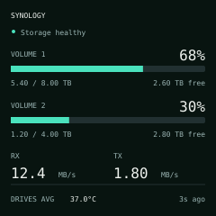
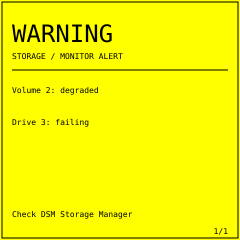
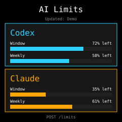

# ESP Display Lab

Build your own firmware for an ESP12F / ESP8266 mini display with a 240 × 240 ST7789 screen. Start with a working dashboard, send readings over Wi-Fi, and update the device from its browser-based firmware uploader.

Inspired by [slavka08/esp-mini_screen](https://github.com/slavka08/esp-mini_screen). This is a standalone repository with selected adapted code and a fresh history. See [ATTRIBUTION.md](ATTRIBUTION.md) for the origins and licensing status of that code.

## Sample firmware

<table>
<tr><th>Synology NAS overview</th><th>Storage warning</th><th>AI usage limits</th></tr>
<tr>
<td></td>
<td></td>
<td></td>
</tr>
</table>

These are illustrative previews with fictional readings, not device photographs. Open [the offline gallery](docs/showcase.html) locally to compare them; its warning animation respects reduced-motion preferences.

| Sample | What it does | Data source | Guide |
| --- | --- | --- | --- |
| **Synology dashboard** | Volume 1 and 2 capacity, RX/TX, average physical-drive temperature; flashing yellow fault reasons; brightness slider | Python sender on the NAS, filesystem/network statistics and local Synology SNMP | [NAS setup](docs/synology.md) |
| **AI limits** | Codex and Claude short-window/weekly bars, remaining percentages and reset text; web test form | Optional Python sender reading local session records, or your own form-encoded uploads | [Limits setup](docs/ai-limits.md) |

Both samples include Wi-Fi setup fallback, a web UI, `GET /state`, and password-protected OTA at `/update`. Brightness control and incremental overview redraws are currently features of the NAS sample. The limits sender is a best-effort local-log reader; it is not an authoritative account usage API.

## Quick start

You need Arduino CLI, Python **3.9+**, ESP8266 Arduino core **3.1.2**, and TFT_eSPI **2.5.43**. A C++ compiler is also needed for host-side tests. Arduino IDE is optional.

```sh
arduino-cli core update-index --additional-urls https://arduino.esp8266.com/stable/package_esp8266com_index.json
arduino-cli core install esp8266:esp8266@3.1.2 --additional-urls https://arduino.esp8266.com/stable/package_esp8266com_index.json
arduino-cli lib install TFT_eSPI@2.5.43

python3 scripts/generate_ota_credentials.py synology
sh scripts/build_firmware.sh synology
```

For the other sample, replace `synology` with `limits` in the last two commands. Each sample has its own private credentials. The generator never overwrites an existing header. Read `firmware/<sketch>/ota_credentials.h` for the updater login.

The result is `build/synology/SDP_synology_ota.bin` or `build/limits/SDP_limits_ota.bin`. The script applies the display pin settings per build and checks the full-image CRC. The known target uses 4 MB flash, a 1 MB filesystem layout, DIO and 40 MHz flash frequency. **Confirm your board matches before flashing.** See [hardware and recovery](docs/hardware.md).

Open `http://<display-ip>/update`, authenticate using the **currently installed firmware's** credentials, and upload the binary in the **Firmware** field. Initial migration from factory firmware depends on its updater format and available OTA space. The `SDP_` filename can satisfy a stock filename check, but does not establish compatibility.

If Wi-Fi is unavailable at boot, join `MiniScreen-Setup` with password `12345678` and open `http://192.168.4.1`. After saving Wi-Fi, return to your normal network and find the device in your router's client list. Configure the appropriate sender using the linked sample guide.

On Apple Silicon, the ESP8266 core's stock macOS tools can require Rosetta even when Arduino CLI is native ARM64. A separately configured native toolchain also works; see [build environments](docs/building.md). Compiler bundles and personalized binaries are not stored in this repository.

## Develop a new firmware

Start with [the development guide](docs/developing.md). It covers sketch structure, pin mapping, EEPROM compatibility, web routes, redraws, brightness, telemetry validation, OTA space, testing, and recovery.

```text
firmware/                  Arduino sketches; one application installed at a time
  esp_synology_display/    NAS overview, warnings, brightness and web UI
  esp_ai_limits/           Usage-limit cards and web test form
senders/                   Host-side Python senders and configuration templates
hardware/                  Reference display configuration
examples/                  Synthetic form payloads for demos and endpoint testing
scripts/                   Build, credentials, image integrity and privacy checks
tests/                     Sender regression tests and native C++ logic checks
docs/                      Setup, developer guides and offline showcase
```

Run the host checks from the repository root:

```sh
sh scripts/test.sh
```

Both samples have been compiled with the ESP8266 core and a native ARM64 host toolchain. Host tests cover NAS faults, missing drives, temperature/capacity math, stale timers, brightness duty, SNMP decoding, and limit payload parsing. Build checks do not establish physical display orientation, PWM behavior, OTA recovery, or accuracy of your NAS/provider readings; verify those on your device.

## Public repository hygiene

Only source, synthetic previews, tests and configuration templates belong in Git. Credentials, real sender configuration, session logs, downloaded toolchains and builds are ignored. Run `python3 scripts/check_public_tree.py` before committing, then review `git diff --cached`. The check catches common accidental identifiers and secret formats; it does not replace reviewing unfamiliar files.

A firmware binary contains its compiled updater password. Build one for your own device instead of publishing a personalized `.bin`. The dashboards use unauthenticated HTTP for local telemetry and controls; the updater uses Basic Authentication. Keep the display on a trusted local network and do not expose these endpoints to the internet.

See [CONTRIBUTING.md](CONTRIBUTING.md), [SECURITY.md](SECURITY.md), and [the code attribution and licensing notes](ATTRIBUTION.md).
